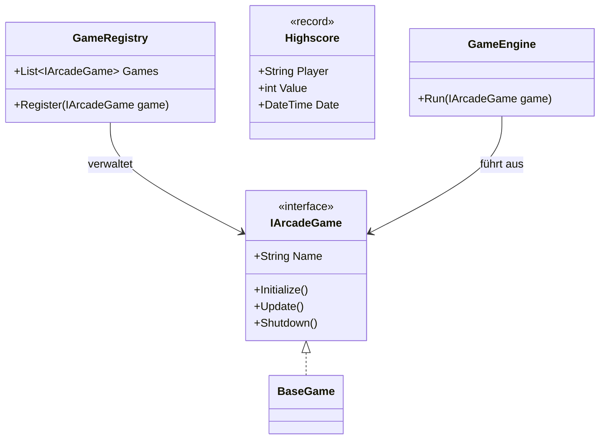

### Programmieren mit C# (DSPC016)

---

### Die übergeordnete Idee: "Das lebende Ökosystem"

Das GAE ist ein **Container**. Die "Spiele" sind keine eigenständigen Programme, sondern **Gäste**, die in diesem
Container leben. Der Container stellt die Infrastruktur (Speicher, Datenbank, Takt, Anzeige) bereit, und die Spiele
nutzen diese.

**Die Aufgabe:** Jede Gruppe baut eine "Säule" dieser Infrastruktur. Damit sie heute starten können, programmieren sie
gegen ein provisorisches Interface, das wir morgen in der Integration zusammenführen.

---

### Das UML-Klassendiagramm (Minimal-Struktur)

---

### Minimale Anforderungen

1. **GAE Core:** Ein Projekt, das nur das Interface `IArcadeGame` und den Record `Highscore` enthält. Alle anderen
   Projekte referenzieren dieses.
2. **Abstraktion:** Kein Projekt darf ein *konkretes* Spiel (z.B. Snake) kennen. Alles läuft über das Interface.
3. **Autonomie:** Jede Gruppe muss eine Klasse liefern, die eine spezifische Dienstleistung für den Host erbringt (
   z.B. "Speichere diesen Highscore" oder "Lade dieses Asset sicher").

---

### Konkrete Start-Aufgaben für die Gruppen

#### Gruppe 1: Memory Safety (Der "Safe-Loader")

* **Theorie:** Wie lade ich Daten, ohne den Garbage Collector zu belasten?
* **Programmier-Task:** Erstellt eine Klasse `SafeBuffer<T>`. Diese nutzt intern `Span<T>` oder `Memory<T>`.
* **Ziel:** Ein Spiel soll bei euch einen "Buffer" anfordern können, um Highscores oder Pixel-Daten zu verarbeiten, ohne
  `new byte[]` aufzurufen.
* **Start-Klasse:** `public class GameResourceManager { ... }`

#### Gruppe 2: LINQ (Der "Statistik-Generator")

* **Theorie:** Deklarative Abfragen auf Objekt-Listen.
* **Programmier-Task:** Erstellt einen `ScoreEvaluator`. Dieser bekommt eine `List<Highscore>` und bietet Methoden an
  wie: `GetTopThree(string gameName)` oder `GetAverageScorePerPlayer()`. Verwendet Expression-Trees zur Abbildung von
  Spielregeln.
* **Ziel:** Nutzt LINQ-Extension-Methods, um komplexe Auswertungen für das Dashboard zu schreiben.
* **Start-Klasse:** `public class AnalyticsService { ... }`

#### Gruppe 3: Concurrency (Der "Async-Ticker")

* **Theorie:** Wie läuft der Game-Loop, ohne dass das UI einfriert?
* **Programmier-Task:** Erstellt eine Klasse `GameLoop`. Diese nutzt `Task.Run` oder `PeriodicTimer`, um in einem festen
  Intervall (z.B. alle 16ms) die `Update()`-Methode eines Spiels aufzurufen.
* **Ziel:** Die Engine muss mehrere Spiele "theoretisch" gleichzeitig verwalten können.
* **Start-Klasse:** `public class AsyncEngine { ... }`

#### Gruppe 4: DDD & EF Core (Der "Persistence-Guard")

* **Theorie:** Daten langfristig und strukturiert speichern.
* **Programmier-Task:** Erstellt ein `DbContext` für SQLite. Definiert eine Entity `GameEntity` und `ScoreEntity`.
* **Ziel:** Schreibt ein Repository, das einen `Highscore`-Record (aus dem Core) entgegennimmt und in die Datenbank
  schreibt.
* **Start-Klasse:** `public class ArcadeRepository { ... }`

#### Gruppe 5: Metaprogrammierung (Der "Auto-Discovery" Agent)

* **Theorie:** Code-Analyse zur Kompilierzeit.
* **Programmier-Task:** Schreibt ein Projekt, das testweise alle Klassen in einer Assembly findet, die ein bestimmtes
  Attribut `[ArcadeGame]` haben.
* **Ziel:** Da der Source Generator schwer zu debuggen ist, startet mit **Reflection**, um die Logik zu testen: "Finde
  alle Spiele im System".
* **Start-Klasse:** `public class DiscoveryService { ... }`

---

### Der Fahrplan für die nächsten 60 Minuten

1. **Zentrales Projekt:** Sie (als Dozent) erstellen schnell das Projekt `GAE.Core` mit dem Interface `IArcadeGame`.
2. **Verteilung:** Alle Gruppen erstellen ihr eigenes Projekt (Class Library) und referenzieren Ihr `GAE.Core`.
3. **Isolation:** Jede Gruppe schreibt nun eine **Test-Unit** (oder eine kleine Konsolen-App innerhalb ihres Ordners),
   um ihre Klasse zu testen.

**Beispiel für Gruppe 2:** Sie füllen eine Liste mit 100 Fake-Highscores und schreiben LINQ-Abfragen, um die Top-Spieler
zu finden. Sie müssen noch nicht wissen, wie das Spiel "Snake" aussieht.

**Dadurch produzieren alle Gruppen heute lauffähigen Code, den wir morgen nur noch wie Legosteine zusammenstecken
müssen.**
