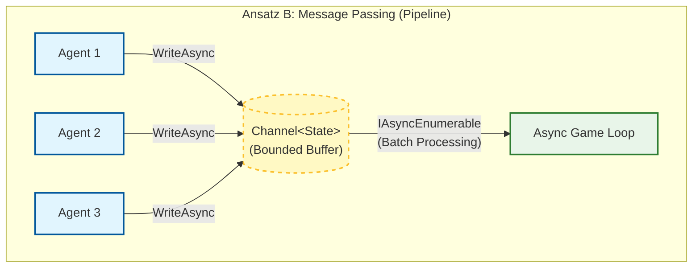
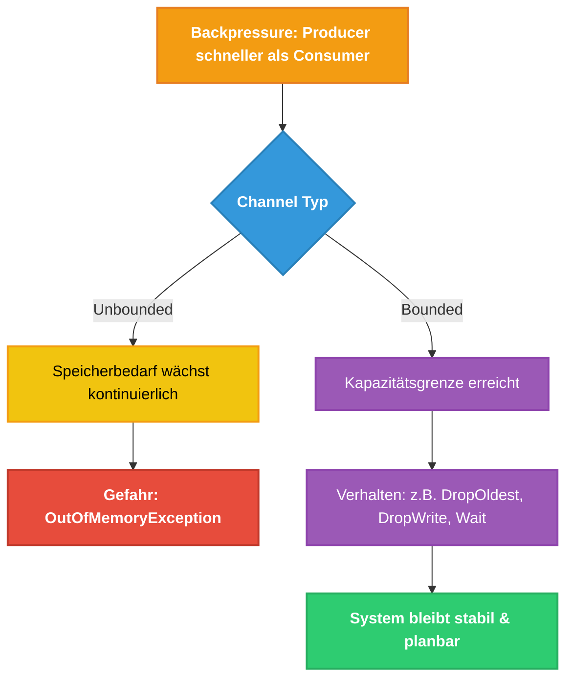

# Channels in Hochlast-Systemen 

---

## 1. Einleitung: Das Backpressure-Problem

In der Entwicklung von verteilten Systemen oder Echtzeit-Applikationen stoßen wir auf eine fundamentale Herausforderung: Die Divergenz zwischen Datenankunft und Datenverarbeitung.

Wissenschaftlich wird dieses Phänomen als "Backpressure" bezeichnet. Laut Yakovlev et al. (2025) tritt Backpressure auf, wenn die Konsumenten-Threads (Consumer) nicht in der Lage sind, mit der Rate der Produzenten-Threads (Producer) Schritt zu halten.

**Strategien im Umgang mit Backpressure:**

- **Producer Regulation:** Drosselung der Quelle (oft unmöglich bei asynchronen Netzwerken).
- **Data Dropping:** Verwerfen von Paketen (oft inakzeptabel bei zustandsrelevanten oder differenziellen Daten).
- **Buffering Received Data (BRD):** Einsatz von asynchronen Zwischenspeichern zur Glättung von temporären Lastspitzen.

---

## 2. Von Shared Memory zu Message Passing

Klassische Ansätze nutzen Shared Memory, geschützt durch Primitiven wie `lock` (Monitors) oder `Mutex`. Bei Hochlast führt dies zu massiver Contention (Ressourcenkonkurrenz) und Context Switches, was den Durchsatz limitiert.

Der Paradigmenwechsel besteht im Übergang zu **Message Passing**. Anstatt den Zustand selbst zu sperren, werden Zustandsänderungen als Nachrichten übergeben.

---

## 3. Theorie: Channels und das Lock-free Paradigma

Um die Nachteile herkömmlicher Locks zu umgehen, abstrahiert `System.Threading.Channels` in .NET komplexe, hardwareunterstützte atomare Operationen (wie Compare-And-Swap, CAS) in einem asynchronen Message-Passing-Modell, das das Producer-Consumer-Pattern abbildet.

**Theoretische Vorteile:**

- **Entkopplung:** Producer und Consumer teilen sich keinen expliziten Zustand mehr. Sie kommunizieren ausschließlich über den Channel.
- **Cache-Effizienz:** Die zugrundeliegende `ConcurrentQueue<T>` in Unbounded Channels minimiert "False Sharing" durch intelligentes Padding und Segmentierung (Memory Locality).
- **Non-blocking Annahme:** Schreiboperationen agieren bei Unbounded Channels blockadefrei, was die Latenz für den Netzwerkeingang minimiert und Thread-Starvation auf der Empfängerseite verhindert.



---

## 4. Code-Demonstration: ChannelBasedGame

Betrachten wir die praktische Umsetzung in unserer Modell-Klasse `ChannelBasedGame`:

### 4.1 Instanziierung & Infrastruktur

```csharp
private readonly Channel<PlayerUpdate> _updateChannel = Channel.CreateUnbounded<PlayerUpdate>(
    new UnboundedChannelOptions { SingleReader = true, SingleWriter = false });
```

**Master-Kritikpunkt (Unbounded vs. Bounded):** Wir nutzen hier `CreateUnbounded`. Das glättet Lastspitzen, löst aber dauerhaftes Backpressure nicht. Produziert das Netzwerk schneller als das Spiel verarbeitet, wächst der Speicherbedarf bis zur `OutOfMemoryException`. Für ausfallsichere Systeme müsste hier ein Bounded Channel (mit Strategien wie `DropOldest`) evaluiert werden.

**Compiler-Optimierungen:** `SingleReader = true` ist entscheidend. Es erlaubt dem JIT-Compiler und der Laufzeitumgebung, auf aufwändige Synchronisation beim Lesen zu verzichten, da garantiert ist, dass nur der Game-Loop (ein Thread) liest. `SingleWriter = false` trägt der Tatsache Rechnung, dass viele Netzwerk-Threads gleichzeitig Pakete anliefern.

### 4.2 Der Producer (Input-Schnittstelle)

```csharp
public void OnNetworkUpdateReceived(PlayerUpdate update)
{
    _updateChannel.Writer.TryWrite(update);
}
```

Der Netzwerk-Thread "wirft" das Paket ein und ist sofort wieder frei. Es findet kein Warten auf ein Lock statt. Die Methode liefert deterministische Latenzen für IO-Threads.

### 4.3 Der Consumer (Verarbeitungs-Logik)

```csharp
public void Update(double deltaTime)
{
    while (_updateChannel.Reader.TryRead(out var update))
    {
        if (GameLogic.IsMovementValid(update))
        {
            _players[update.PlayerId] = update;
        }
    }
}
```

Der Game-Loop leert den Puffer in jedem Tick (asynchrone Entkopplung im synchronen Loop). Da die Validierung (`IsMovementValid`) rechenintensiv ist, sorgt der Channel dafür, dass die Annahme neuer Pakete im Hintergrund während dieser Berechnung nicht durch Locks blockiert wird.

---

## 5. Fazit und Performance-Einordnung

**Zusammenfassung der Erkenntnisse:**

- **Geringe Last:** Traditionelle Locks können leicht überlegen sein, da der Infrastruktur-Overhead eines Channels (Allokationen für Segmente/Nodes in der Queue) fehlt.
- **Hohe Last:** Channels glänzen durch Skalierbarkeit. Die architektonische Entkopplung verhindert, dass ein "Server-Side Bottleneck" (langsame Verarbeitung in der GameLogic) auf die Clients (Datenannahme im Netzwerk-Socket) zurückschlägt.

Wissenschaftlich lässt sich festhalten: Die Wahl zwischen Shared Memory (Locks) und Message Passing (Channels) ist eine Wahl zwischen CPU-Zyklen-Effizienz bei niedriger Last und System-Resilienz sowie Vorhersagbarkeit bei hoher Last. Für moderne, verteilte Echtzeit-Systeme ist das Channel-Modell aufgrund seiner deterministischen Latenz-Eigenschaften an der I/O-Grenze vorzuziehen.

---

## 6. Vollständige Implementierung: `ChannelBasedGame`

Die folgenden Ausschnitte aus den Abschnitten 4.1–4.3 lassen sich nun in der vollständigen Klasse zusammenführen. Sie implementiert das Interface `IArcadeGame` und zeigt, wie alle Konzepte – Channel-Infrastruktur, Producer, Consumer sowie Lifecycle-Management – in einer produktionsnahen Einheit zusammenspielen:

```csharp
using System.Threading.Channels;

namespace GAE.Async;

public class ChannelBasedGame : IArcadeGame
{
    // ── Metadaten ────────────────────────────────────────────────────────────
    public string Name => "Channel-Based Sync";

    // ── Zustand ──────────────────────────────────────────────────────────────
    // Nur vom Game-Loop (Consumer) beschrieben → kein zusätzlicher Lock nötig,
    // da SingleReader = true den exklusiven Zugriff auf Reader-Seite garantiert.
    private readonly Dictionary<int, PlayerUpdate> _players = new();

    // ── Channel-Infrastruktur (Abschnitt 4.1) ────────────────────────────────
    // Unbounded: blockadefrei für Producer, Speicher wächst bei dauerhaftem
    // Backpressure → für ausfallsichere Systeme Bounded Channel evaluieren.
    private readonly Channel<PlayerUpdate> _updateChannel = Channel.CreateUnbounded<PlayerUpdate>(
        new UnboundedChannelOptions
        {
            SingleReader = true,   // Nur der Game-Loop liest → JIT-Optimierung
            SingleWriter = false   // Viele Netzwerk-Threads schreiben gleichzeitig
        });

    // ── Producer (Abschnitt 4.2) ─────────────────────────────────────────────
    // Wird von beliebig vielen IO-Threads aufgerufen.
    // TryWrite ist lock-free → deterministisch niedrige Latenz.
    public void OnNetworkUpdateReceived(PlayerUpdate update)
    {
        _updateChannel.Writer.TryWrite(update);
    }

    // ── Consumer (Abschnitt 4.3) ─────────────────────────────────────────────
    // Wird einmal pro Game-Tick vom Game-Loop aufgerufen (synchroner Kontext).
    // Leert den gesamten Puffer, bevor der Tick weiterläuft.
    public void Update(double deltaTime)
    {
        while (_updateChannel.Reader.TryRead(out var update))
        {
            if (GameLogic.IsMovementValid(update))
            {
                _players[update.PlayerId] = update;
            }
        }
    }

    // ── Lifecycle ────────────────────────────────────────────────────────────
    public void Initialize() => Console.WriteLine($"{Name} initialisiert.");
    public void Render() { }
    public void Shutdown() => _players.Clear();
    public void Dispose()  => Shutdown();
}
```

**Beobachtungen zur vollständigen Klasse:**

- **Trennung der Verantwortlichkeiten:** `OnNetworkUpdateReceived` (Producer-Seite) und `Update` (Consumer-Seite) teilen keinerlei Locks. Der Channel ist die einzige Kommunikationsbrücke.
- **Lifecycle-Sicherheit:** `Shutdown` / `Dispose` leeren lediglich `_players`. Der Channel selbst wird durch den GC aufgeräumt, da `Channel<T>` keine unmanaged Ressourcen hält.
- **Erweiterbarkeit:** Ein Wechsel zu `Channel.CreateBounded<PlayerUpdate>(new BoundedChannelOptions(1024) { FullMode = BoundedChannelFullMode.DropOldest })` würde den Memory-Growth bei dauerhaftem Backpressure eliminieren, ohne die restliche Klasse zu verändern – ein direkter Beleg für die Entkopplungsstärke des Channel-Musters.

---

## Quellen

- Yakovlev, S. et al. (2025). *Optimizing Lock-Free Containers for Multithreaded Socially Oriented Information Systems.*
- Pankratius, V. & Adl-Tabatabai, A. (2011). *A study of transactional memory vs. locks in practice.* ACM SPAA.
