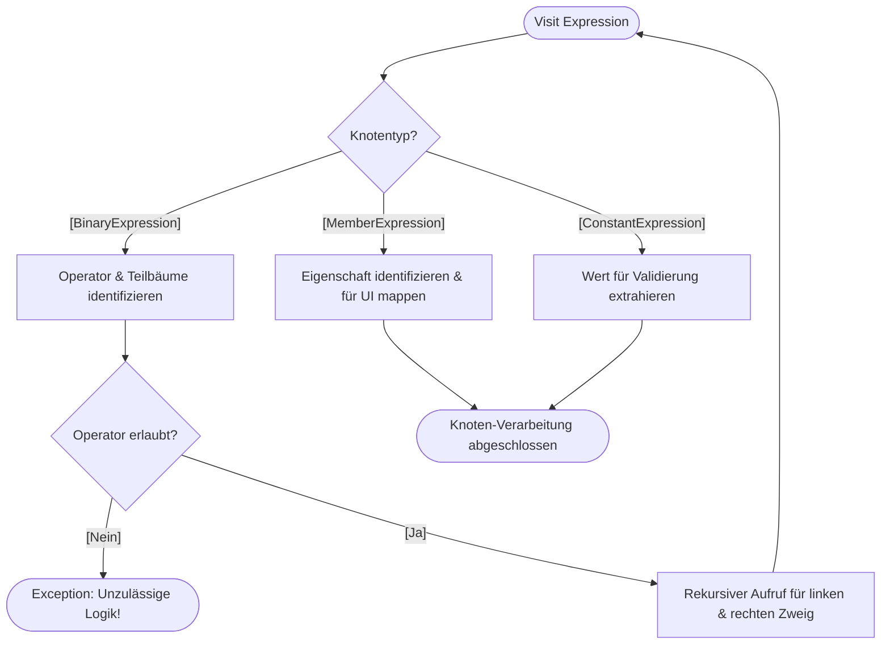

## Aktivitätsdiagramm - Rekursive Iteration des AST¹

* **Zentraler Einstiegpunkt:** Engine erhält den Lambda-Ausdruck und beginnt die Analyse an der Wurzel des Baums

* **Knoten-Differenzierung:** Programm erkennt automatisch, ob es sich um eine Operation (z. B. >, &&), einen Datenzugriff (Player.Score) oder einen festen Wert handelt

* **Wissenschaftliche Validierung:** jeder Operator wird geprüft => stellt sicher, dass nur definierte formale Prädikate zulässig sind und keine gefährlichen Systembefehle eingeschleust werden

* **Rekursives Traversieren:** bei binären Ausdrücken ruft sich die Analyse-Logik selbst für die untergeordneten Zweige auf, bis alle Blätter des Baums erreicht sind

* **Logik-Visualisierung:** Extraktion und Übersetzung technischer Feld-Metadaten zur deklarativen Darstellung im UI

---

¹AST: Abstract Syntax Tree (= baumartige Datenstruktur, die die logische Struktur von Programmcode als verarbeitbare Objekte darstellt)

