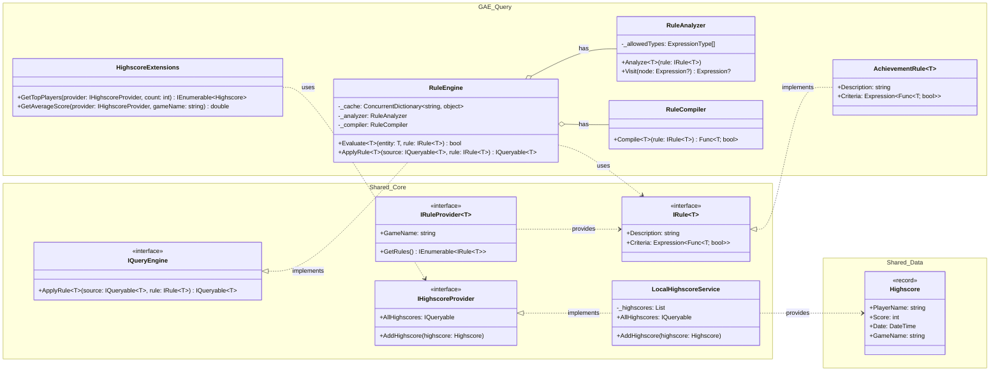

## Klassendiagramm

### Shared.Data

`Highscore` ist als Immutable Data Transfer Object (DTO) konzipiert, um sicherzustellen, dass die Query Engine auf Basis von stabilen Datensätzen arbeitet (Objekt kann nicht mehr verändert werden -> man erzeugt ein neues)

### Shared.Core

* `IHighscoreProvider`: abstrahiert den Datenzugriff
* `LocalHighscoreService`: verwaltet die Highscores in einer In-Memory-Liste und dient in der Architektur als austauschbare Datenquelle
* `IRule<T>`: kapselt die Logik in einem Expression-Tree, wodurch Code zur Laufzeit analysierbar und transformierbar wird
* `IQueryEngine`: erlaubt es, komplexe Filterregeln auf beliebige Datenquellen anzuwenden, ohne deren interne Struktur zu kennen
* `IRuleProvider`: ermöglicht die Plugin-Architektur - Spielmodule fungieren als eigenständige Provider, die ihre Regeln zur Laufzeit in das Dashboard einspeisen, während der Kern der Engine als stabile, unveränderliche Komponente bestehen bleibt

### GAE.Query

* `RuleEngine`:
  * koordiniert den Analyse- und Kompilierungsprozess und bietet mit Evaluate eine Methode für Echtzeit-Prüfungen (z. B. Achievements während des Spiels) an
  * ein ConcurrentDictionary dient als Thread-sicherer Cache, um die teure Kompilierung pro Regel nur einmal durchzuführen
* `RuleAnalyzer`: inspiziert den abstrakten Syntaxbaum (AST), um Operatoren zu identifizieren und die Sicherheit der Regel zu garantieren, bevor sie ausgeführt wird
* `RuleCompiler`: wandelt den deklarativen Baum (Expression) in hocheffizienten, nativen Maschinencode (Func) um
* `HighscoreExtensions`: nutzt LINQ-Aggregationen, um geschäftsrelevante Daten wie Bestenlisten oder Durchschnittswerte direkt aus den Highscore-Streams zu generieren
* `AchievementRule<T>`: dient als Vorlage für das Dashboard, um zur Laufzeit neue Erfolgsbedingungen zu definieren

### zentrale Merkmale

* **deklarative Programmierung:** `Criteria` in `IRule` definiert nur, was erfüllt sein muss, die technische Umsetzung übernimmt die Engine

* **Immutability:** `Highscore` als Record stellt sicher, dass die Datenquelle während der Analyse stabil bleibt

* **Lazy Evaluation:** `IQueryable<T>` als Rückgabewert in `IQueryEngine`: Regeln werden erst als abstrakte Bäume definiert und erst bei Datenabfrage in ausführbaren Code kompiliert

* **Higher-Order Functions:** `RuleCompiler` transformiert deklarative `Criteria` und gibt ausführbare Funktion zurück
