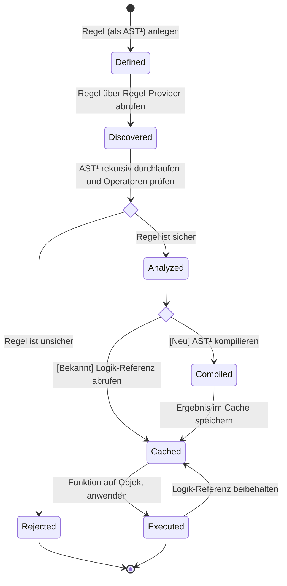
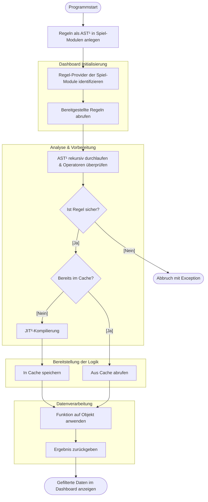
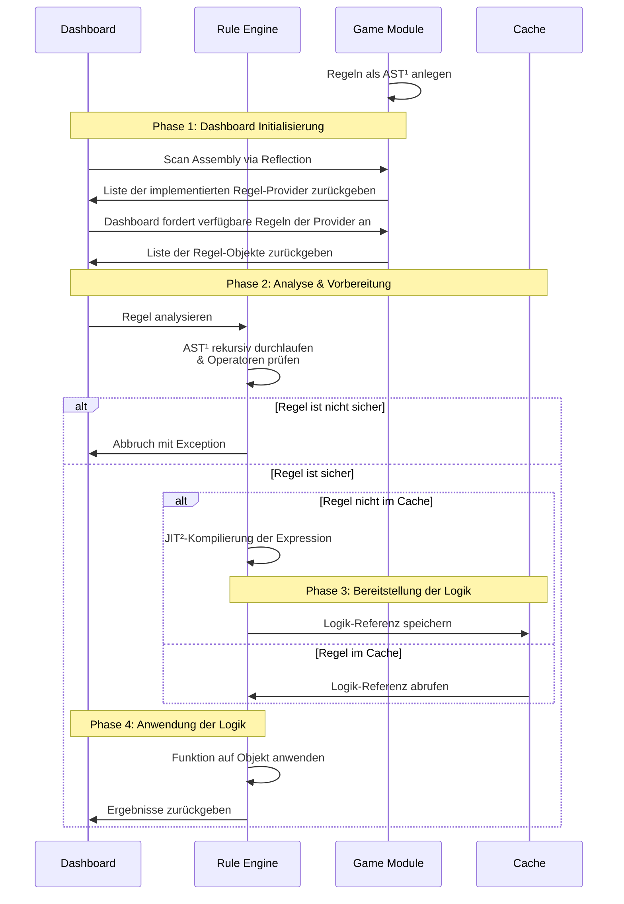

## Zustandsdiagramm - Lebenszyklus einer deklarativen Regel

## Aktivitätsdiagramm - Prozessmodell der Rule-Engine

## Sequenzdiagramm - Engine-Plugin-Kommunikation

Zeigt, wie das Dashboard eine Regel von einem Spiel-Modul erhält und diese über die Engine gegen die Highscore-Daten prüft.

---

¹AST: Abstract Syntax Tree (= baumartige Datenstruktur, die die logische Struktur von Programmcode als verarbeitbare Objekte darstellt)

²JIT: Just-in-Time (auch bedarfssynchron bezeichnet)
