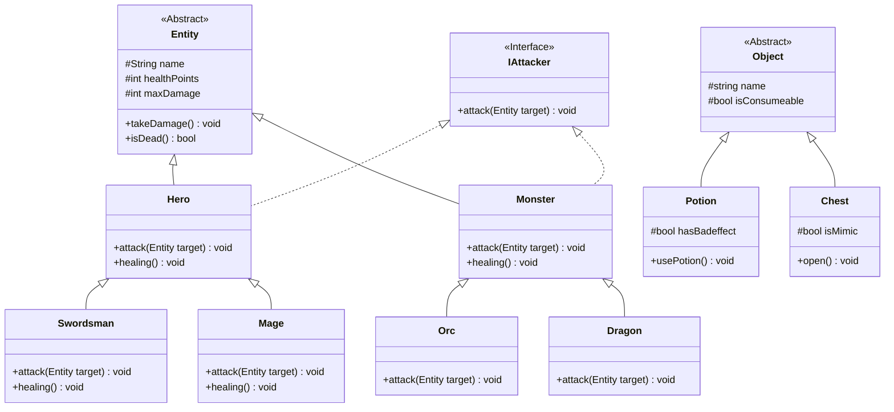

UML Klassendiagramm - Rollenspiel

```mermaid
classDiagram
    %% --- Abstrakte Basisklassen & Interfaces ---
    class Entity {
        <<Abstract>>
        #String name
        #int healthPoints
        #int maxDamage
        +takeDamage() void
        +isDead() bool
    }

    class IAttacker {
        <<Interface>>
        +attack(Entity target) void
    }

    class Object {
        <<Abstract>>
        #string name
        #bool isConsumeable
    }

    class Hero {
        +attack(Entity target) void
        +healing() void
    }

    class Monster {
        +attack(Entity target) void
        +healing() void
    }

    class Swordsman {
        +attack(Entity target) void
        +healing() void
    }

    class Mage {
        +attack(Entity target) void
        +healing() void
    }

    class Orc {
        +attack(Entity target) void
    }

    class Dragon {
        +attack(Entity target) void
    }

    class Potion {
        #bool hasBadeffect
        +usePotion() void
    }

    class Chest {
        #bool isMimic
        +open() void
    }

    Entity <|-- Hero
    Entity <|-- Monster
    Hero <|-- Swordsman
    Hero <|-- Mage
    Monster <|-- Orc
    Monster <|-- Dragon
    Object <|-- Potion
    Object <|-- Chest

    IAttacker <|.. Hero
    IAttacker <|.. Monster
```

