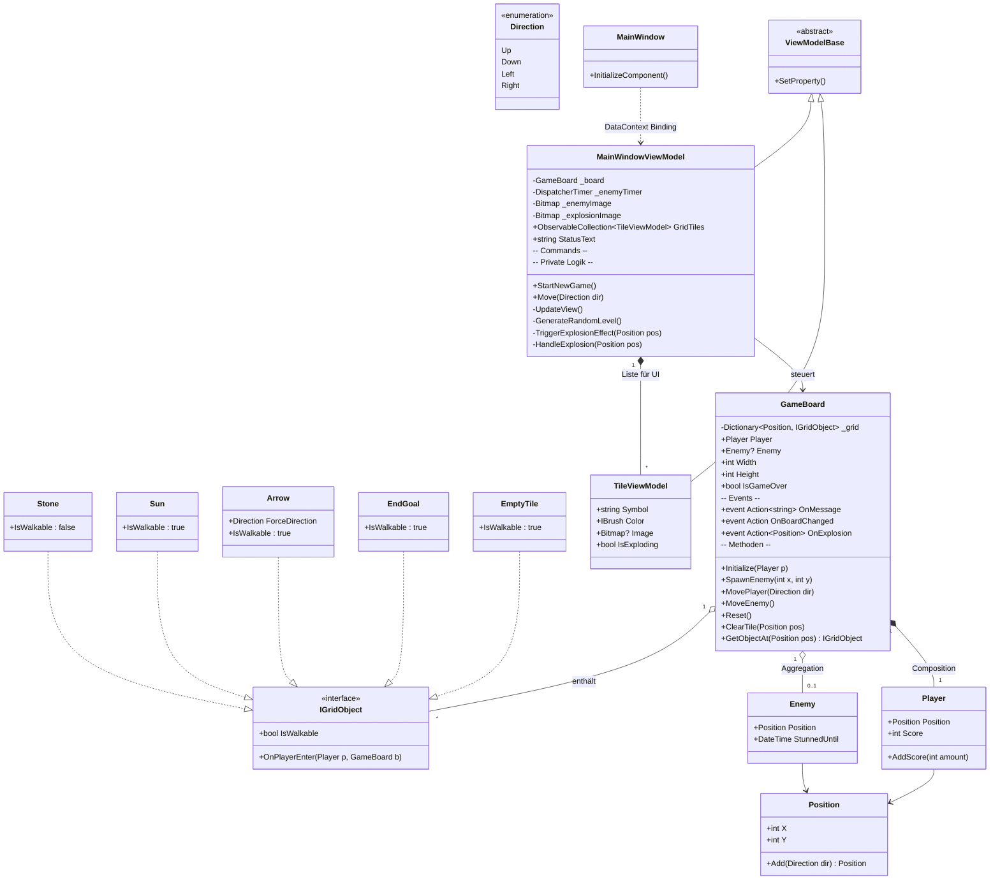
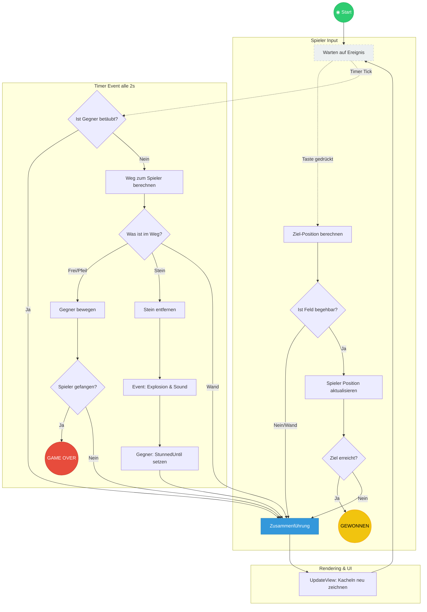

# GameOfBichler - UML Klassendiagramm

Dieses Diagramm stellt die Architektur der Windows/Avalonia-Desktop-Anwendung dar. Es zeigt die Trennung zwischen **Model** (Logik), **ViewModel** (Vermittler) und **View** (UI).

