# Concurrency Models in Game loops

## 1. Einleitung

In der Entwicklung des *Grand Arcade Ecosystems* (GAE) stehen wir vor der Herausforderung, den Zustand hunderter autonomer Agenten in einen einzigen, getakteten Game-Loop zu integrieren. Die klassische Softwareentwicklung in C# bietet hierfür zwei fundamentale Paradigmen, deren Eignung für High-Performance-Szenarien wir evaluieren:

1.  **Shared Memory Concurrency (Locking):** Direkter Zugriff auf gemeinsame Speicherbereiche, geschützt durch Mutex-Mechanismen (z.B. `lock`, `Monitor`).
2.  **Message Passing Concurrency (Channels):** Entkopplung von Produzenten und Konsumenten durch asynchrone Warteschlangen (`System.Threading.Channels`), inspiriert durch das Actor-Model.

## 2. Analyse der Mechanismen

### A. Klassisches Locking (`Monitor` / `lock`)
Beim Locking versuchen mehrere Threads (Agenten), exklusiven Zugriff auf das *Shared Game State Object* zu erhalten, um ihre Updates zu schreiben.

* **Mechanismus:** Wenn Thread A den Lock hält, wird Thread B vom Betriebssystem-Scheduler blockiert (Preemption).
* **Das Problem "Context Switching":**
    * Ein blockierter Thread wird "schlafen gelegt". Dies erfordert einen **Context Switch** (Speichern der Register, Cache-Invalidierung, Wechsel in den Kernel-Mode).
    * Wenn der Lock frei wird, muss der Thread wieder aufgeweckt werden.
    * *Wissenschaftliche Relevanz:* Context Switches sind teuer (Größenordnung: 1-5 µs). In einem Game-Loop, der nur 16ms (60 FPS) Zeit pro Frame hat, führt hohe *Lock Contention* zu unvorhersehbaren Latenzspitzen (Jitter).
* **Thread Starvation:** Bei hoher Last kann es passieren, dass bestimmte Agenten statistisch benachteiligt werden und ihren Zustand selten schreiben können.

### B. System.Threading.Channels (Bounded)
Channels implementieren das *Producer-Consumer-Pattern*. Agenten schreiben ihre Updates in eine Warteschlange, der Game-Loop liest sie aus.

* **Mechanismus:** `Channel<T>` nutzt intern hochoptimierte `SpinLocks` für extrem kurze Zeiträume und wechselt bei Wartezeiten sofort auf asynchrone Kontinuationen (`await`).
* **Vorteil "No Blocking":**
    * Wenn der Channel voll ist (Bounded), blockiert der Producer-Thread **nicht**. Stattdessen gibt er den Thread an den Thread-Pool zurück (`await WriteAsync`). Es findet kein harter Context Switch auf OS-Ebene statt, sondern ein logischer Task-Switch in der .NET Runtime.
* **Das Konzept "Backpressure" (Gegendruck):**
    * Wir begrenzen die Kapazität des Channels. Ist der Game-Loop (Consumer) zu langsam, werden die Agenten (Producer) automatisch ausgebremst. Dies verhindert Memory Bloat und stabilisiert das System.

```mermaid
sequenceDiagram
    autonumber
    
    box "Szenario A Locking Monitor" #fff0f0
        participant TA as Thread A Agent
        participant MutexObj as Mutex Lock
        participant GL as Game Loop
    end

    box "Szenario B Channels" #f0faff
        participant TB as Thread B Agent
        participant Chan as Channel
        participant GL_Async as Async Game Loop
    end

    %% SCENARIO A
    rect rgb(255, 230, 230)
        Note over TA, GL: Blockierendes Verhalten
        GL->>MutexObj: Enter Lock Start Update
        activate MutexObj
        TA->>MutexObj: Versucht Zugriff Update State
        Note right of TA: BLOCKED OS Context Switch - Thread schläft Ressourcen gebunden
        GL-->>MutexObj: Exit Lock Fertig
        deactivate MutexObj
        TA->>MutexObj: Erhält Zugriff Wacht auf
        TA-->>MutexObj: Schreibt Daten
    end

    %% SCENARIO B
    rect rgb(230, 255, 240)
        Note over TB, GL_Async: Asynchrones Verhalten
        TB->>Chan: WriteAsync State
        alt Channel voll Backpressure
            Chan-->>TB: Await Thread kehrt zum Pool zurück
            Note right of TB: Thread ist FREI für andere Tasks
        else Channel hat Platz
            Chan-->>TB: Ack Sofort fertig
        end
        GL_Async->>Chan: ReadAllAsync
        Chan-->>TB: Signalisiert Platz frei
        Note right of TB: Task Continuation Resume
    end
```

```mermaid
graph LR
    %% Styles
    classDef producer fill:#e1f5fe,stroke:#01579b,stroke-width:2px;
    classDef storage fill:#fff9c4,stroke:#fbc02d,stroke-width:2px,stroke-dasharray: 5 5;
    classDef consumer fill:#e8f5e9,stroke:#2e7d32,stroke-width:2px;
    classDef bottleneck fill:#ffcdd2,stroke:#c62828,stroke-width:3px;
    
    subgraph Classic_Locking ["❌ Ansatz A: Shared Memory (Bottleneck)"]
        direction LR
        A1[Agent 1]:::producer
        A2[Agent 2]:::producer
        A3[Agent 3]:::producer
        
        Lock{🔒 LOCK}:::bottleneck
        
        State[(Shared State<br/>Mutable Object)]:::storage
        
        Loop1[Game Loop]:::consumer

        A1 -- "Wartet..." --> Lock
        A2 -- "Wartet..." --> Lock
        A3 -- "Schreibt" --> Lock
        
        Lock <--> State
        Loop1 <-->|"Liest (Blockiert alle)"| Lock
    end

    subgraph Channel_Arch ["✅ Ansatz B: Message Passing (Pipeline)"]
        direction LR
        B1[Agent 1]:::producer
        B2[Agent 2]:::producer
        B3[Agent 3]:::producer
        
        Channel[("Channel&lt;State&gt;<br/>(Bounded Buffer)")]:::storage
        
        Loop2[Async Game Loop]:::consumer

        B1 -- "WriteAsync" --> Channel
        B2 -- "WriteAsync" --> Channel
        B3 -- "WriteAsync" --> Channel
        
        Channel -- "IAsyncEnumerable<br/>(Batch Processing)" --> Loop2
    end
```

## 3. Vergleichsmatrix

| Merkmal | Lock / Monitor | System.Threading.Channels |
| :--- | :--- | :--- |
| **Modell** | Pessimistic Locking (Shared Memory) | Message Passing / Queuing |
| **Kosten bei Wartezeit** | Blockiert OS-Thread (Teuer) | Gibt Thread frei (Task Continuation, Günstig) |
| **Overhead** | Gering (bei wenig Contention) | Mittel (Allocation für Nachrichten/Tasks) |
| **Skalierung unter Last** | Schlecht (Lineare Zunahme von Context Switches) | Gut (Konstanter Durchsatz durch Async I/O) |
| **Flow Control** | Nicht existent (Risiko: Dirty Reads) | Eingebaut via Backpressure (Bounded Capacity) |
| **Architektur** | Kopplung Logik <-> Threading | Entkopplung Producer <-> Consumer |

## 4. Wissenschaftliche Hypothese

Basierend auf der Analyse von *Amdahls Gesetz* und den Kosten für *Kernel-Mode Transitions* stellen wir folgende Hypothese auf:

> **Hypothese:**
> Bei einer geringen Anzahl von Agenten (< 10) wird die `lock`-basierte Lösung aufgrund des geringeren Overhead schneller sein.
>
> Sobald jedoch die Update-Frequenz die Verarbeitungsgeschwindigkeit des Game-Loops übersteigt (*Sättigung*), wird die **Channel-basierte Architektur** überlegen sein, indem sie:
> 1.  Einen stabileren Frame-Takt (weniger Jitter) gewährleistet.
> 2.  Den CPU-Durchsatz maximiert (keine blockierten Threads).
> 3.  Durch *Backpressure* Systemüberlastung verhindert.

## 5. Implikation für GAE.Shared.Kernel

Um diese Hypothese zu beweisen, muss der Shared Kernel eine Abstraktion bieten, die den Datentransport kapselt. Module (Spiele) dürfen nicht wissen, ob im Hintergrund gelockt oder gequeued wird.

## 6. Literaturverzeichnis

# Literaturverzeichnis

**Albahari, J. (2022).** *C# 10 in a Nutshell: The Definitive Reference*. O'Reilly Media.
> *Verwendung:* Detaillierte Analyse der `Monitor`-Klasse und des `lock`-Keywords sowie der internen Funktionsweise von Threading in der CLR.

**Amdahl, G. M. (1967).** Validity of the single processor approach to achieving large scale computing capabilities. *Proceedings of the AFIPS Spring Joint Computer Conference*, 483–485. https://doi.org/10.1145/1465482.1465560
> *Verwendung:* Das theoretische Limit der Parallelisierung (Amdahls Gesetz), das die Basis für unsere Hypothese zur Skalierbarkeit unter Last bildet.

**Microsoft. (2024).** *System.Threading.Channels Namespace*. Microsoft Learn. Abgerufen am 2. Februar 2026, von https://learn.microsoft.com/en-us/dotnet/api/system.threading.channels
> *Verwendung:* Offizielle Spezifikation der API und des Verhaltens von `BoundedChannelOptions` (FullMode.Wait).

**Toub, S. (2019, 19. November).** *An Introduction to System.Threading.Channels*. .NET Blog. https://devblogs.microsoft.com/dotnet/an-introduction-to-system-threading-channels/
> *Verwendung:* Die interne Architektur von Channels und die Implementierung des Producer-Consumer-Patterns in .NET Core.
